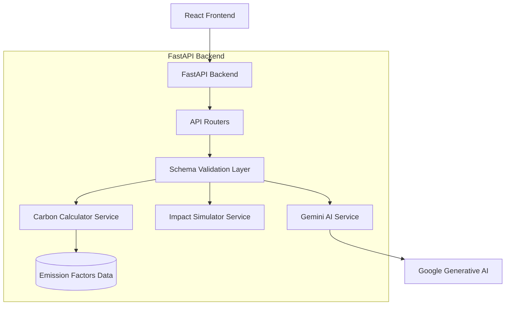

# Carbon Compass Architecture

## High-Level Diagram



## Folder Structure
```text
backend/
├── app/
│   ├── api/
│   │   └── routes/ (carbon.py, decision.py, simulator.py, coach.py)
│   ├── core/
│   │   ├── config.py (Environment Variables)
│   │   └── emission_factors.py (Centralized constants)
│   ├── schemas/ (Pydantic Input/Output validation)
│   │   ├── carbon.py
│   │   ├── decision.py
│   │   └── simulator.py
│   ├── services/ (Business Logic)
│   │   ├── carbon_calculator.py
│   │   ├── gemini_service.py
│   │   └── simulator_service.py
│   └── main.py (FastAPI App Definition)
├── tests/
│   ├── test_api.py
│   ├── test_carbon_calculator.py
│   └── test_simulator_service.py
├── .env.example
├── locustfile.py
├── requirements.txt
├── README.md
├── TESTING.md
└── ARCHITECTURE.md
```

## API Documentation
Once the server is running, FastAPI automatically generates interactive documentation accessible at:
- **Swagger UI**: `http://localhost:8000/docs`
- **ReDoc**: `http://localhost:8000/redoc`

## Security Considerations
- **CORS Configuration**: Handled globally in `main.py`.
- **Validation**: Strict Pydantic models prevent NoSQL injection or malformed data attacks.
- **Graceful Degradation**: Try/except blocks around all external Google Gemini network calls prevent system crashes.

## Accessibility Features
While mostly applicable to the frontend, the backend supports accessibility by:
- Returning simple, localized strings instead of complex error codes.
- Providing structured data that the frontend can easily read aloud or map to ARIA labels.

### WCAG Mapping Architecture (Frontend)
1. **Perceivable**: Handled via CSS variables and Tailwind class injection (`data-theme`, `reading-mode`) managed by `AccessibilityContext`. Chart libraries (Recharts) are enhanced with custom sr-only components.
2. **Operable**: Built-in React hooks (`useSpeechRecognition`, `useTextToSpeech`) wrap the native browser Web Speech APIs to eliminate backend dependency. Keyboard shortcuts (`Alt+A`, `Alt+R`) are managed globally.
3. **Understandable**: AI Service guarantees plain-language text outputs that are easy to parse and read aloud.
4. **Robust**: Semantic tags (`main`, `nav`) and ARIA live regions (`aria-live="polite"`) ensure compatibility with modern assistive technologies without custom DOM manipulation.
