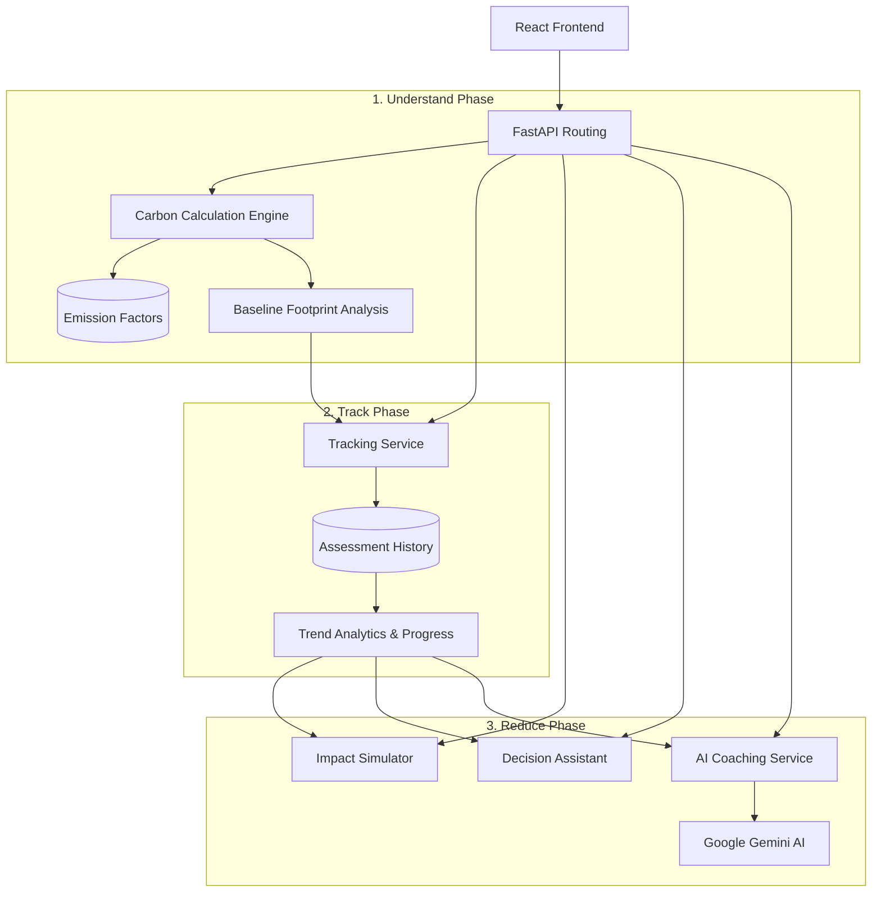
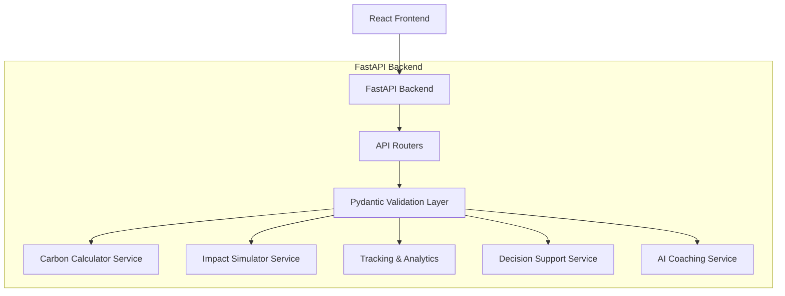

# Carbon Compass Backend Architecture

## Purpose
The Carbon Compass backend is explicitly designed to support the complete sustainability lifecycle, ensuring users can systematically lower their environmental impact.

The backend provides validated calculations, sustainability intelligence, decision support, and AI-powered coaching services.

---

## 1. Sustainability Data Lifecycle

Data flows through the backend in a continuous loop designed to encourage behavioral change:



---

## 2. Core Service Mapping

Every module in the backend architecture serves a specific role in solving the core sustainability challenge.

### Understand Your Footprint
| Backend Service | Sustainability Outcome | Description |
| :--- | :--- | :--- |
| **Carbon Calculator Engine** | Understand footprint | Transforms user lifestyle inputs into category-wise emissions breakdowns using validated emission factors. |
| **Data Contextualization** | Understand emission sources | Breaks down raw metrics into human-readable data points mapping directly to daily activities. |

### Track Your Progress
| Backend Service | Sustainability Outcome | Description |
| :--- | :--- | :--- |
| **Tracking Service Layer** | Track progress | Maintains longitudinal records of completed assessments to build a continuous user journey. |
| **Trend Analytics** | Visualize improvement | Calculates week-over-week improvements and evaluates changes against historical baselines. |

### Reduce Your Emissions
| Backend Service | Sustainability Outcome | Description |
| :--- | :--- | :--- |
| **Impact Simulator** | Reduce emissions | Projects future emissions savings resulting from proposed behavioral shifts. |
| **Decision Support Engine** | Sustainable choices | Evaluates trade-offs between alternative actions (e.g., transport modes) and provides data-driven recommendations. |
| **AI Sustainability Coach** | Behavioral change | Delivers personalized guidance, educational content, and tailored reduction strategies using generative AI. |

---

## 3. Technical Architecture



### Folder Structure
```text
backend/
├── app/
│   ├── api/
│   │   └── routes/
│   │       ├── carbon.py
│   │       ├── decision.py
│   │       ├── simulator.py
│   │       └── coach.py
│   ├── core/
│   │   ├── config.py
│   │   └── emission_factors.py
│   ├── schemas/
│   │   ├── carbon.py
│   │   ├── decision.py
│   │   └── simulator.py
│   ├── services/
│   │   ├── carbon_calculator.py
│   │   ├── simulator_service.py
│   │   └── gemini_service.py
│   └── main.py
├── tests/
├── requirements.txt
├── README.md
└── ARCHITECTURE.md
```

---

## 4. API Documentation
When running locally, FastAPI automatically generates interactive documentation:
* Swagger UI: `http://localhost:8000/docs`
* ReDoc: `http://localhost:8000/redoc`

---

## 5. Security & Reliability Architecture
* **Validation:** Strict Pydantic models guarantee deterministic calculations.
* **Network Reliability:** External API calls to Google Gemini are wrapped in resilient error-handling blocks with localized intelligence fallbacks to ensure uninterrupted service delivery.
* **Routing:** Centralized FastAPI routing limits attack vectors.

---

## 6. Accessibility Support
The backend contributes to inclusive design by:
* Returning structured, predictable data models optimized for screen-reader parsing.
* Ensuring all AI-generated content follows plain-language principles.
* Maintaining stable, deterministic response times to prevent UI disorientations for cognitively impaired users.
